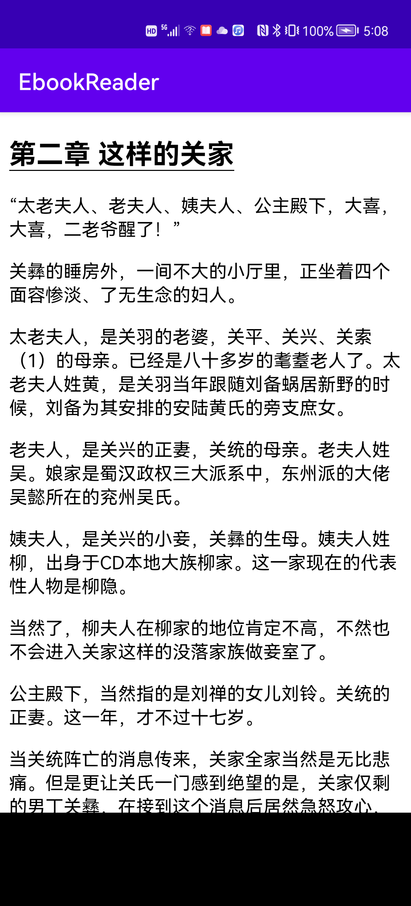
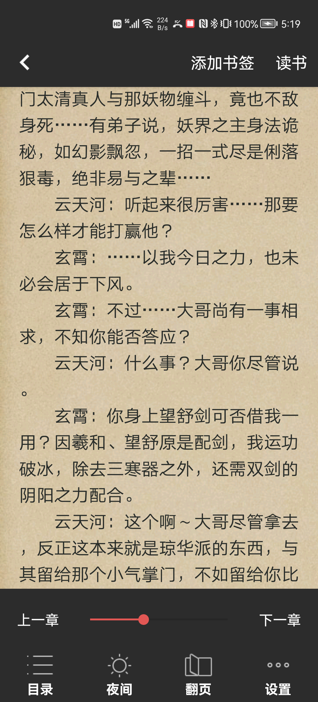

# EbookReader

The EbookReader is an Android application for reading books on Android devices. It supports many document formats, such as TXT, MOBI, AZW, AZW3, AZW4, PDF, XPS, OpenXPS, CBZ, EPUB, and FictionBook 2.

-----------------------

2021.12.11 增加mobi, azw, azw3, azw4, fb2, cbz, xps, openxps格式电子书支持;

2021.12.13 修复之前的txt阅读界面bug;

2021.12.15 增加tts阅读支持;

---------------

App Screen Shots:

支持Epub格式和Pdf格式文件

阅读界面：

阅读设置：

